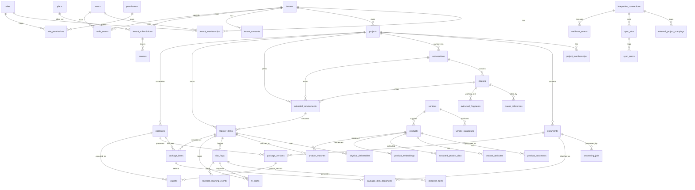

# Entity Relationship Diagram

Every tenant-owned table carries `tenant_id` (RLS scope). Child tables use **composite foreign keys
`(tenant_id, parent_id)`** so a row can never link to a parent in another tenant. Only key relations
are shown below; see [tables.md](tables.md) for full columns.

## Domain groups

- **Tenancy / IAM** — tenants, users, roles, permissions, role_permissions, tenant_memberships, project_memberships
- **Documents** — documents, processing_jobs
- **Specs** — worksections, clauses, clause_references, extracted_fragments, addenda_reconciliations, submittal_requirements
- **Register / workflow** — register_items, physical_deliverables, packages, package_items, package_item_documents, package_versions, exports
- **Vendors / matching** — vendors, vendor_catalogues, products, product_documents, product_attributes, extracted_product_data, product_embeddings, product_matches
- **Risk / RFI / learning** — risk_flags, checklist_items, rfi_drafts, rfi_cited_clauses, rfi_cited_documents, rejection_learning_events, tenant_consents
- **Audit** — audit_events (append-only)
- **Billing** — plans, tenant_subscriptions, invoices, usage_counters
- **Content** — knowledge_base_articles (global, not tenant-owned)
- **Integrations** — integration_connections, external_project_mappings, sync_jobs, webhook_events, sync_errors
